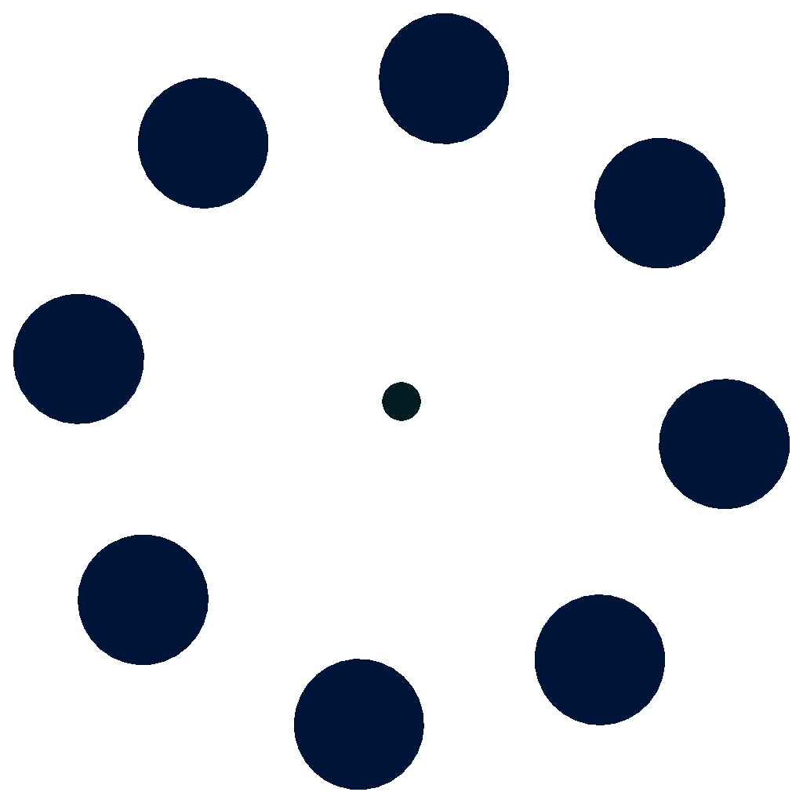

# hexanimate
A loading animation created using opens can for the raw images. Phatch was used for post-processing (color to alpha, resizing and anti-aliasing) and finally Gimp to create the gif image. 

Danke 

##"Building"
You will need

* Python 3 to run the [generate pictures.py](generation script) 
* Openscad 2015—03 or later(for the viewport variables) 
* phatch if you want to run the phatch command provided
* Gimp to make the final image:
   1. Open the first image (sample0000.png).
   2. Click File > Open as Layers and choose all other pictures. They should be imported in the right order. 
   3. File Export and choose gif as file format. Click Export, set a image info text, tick 'Animate'and set the delay between frames (40ms@100 frames is a good value). When using transparent images you have to choose the 'replace' method in the frame disposal dropdown. Tick the checkboxes to apply frame disposal and delay to all images.  Then export the image.
